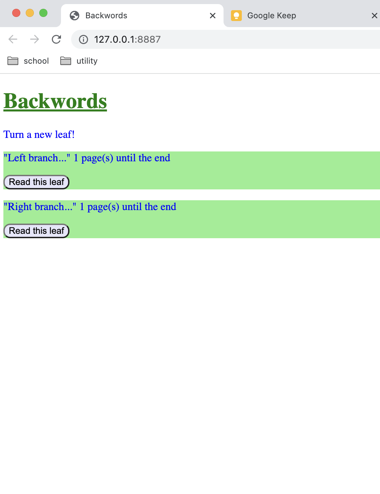
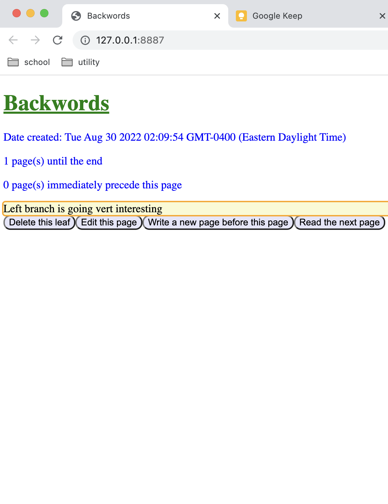
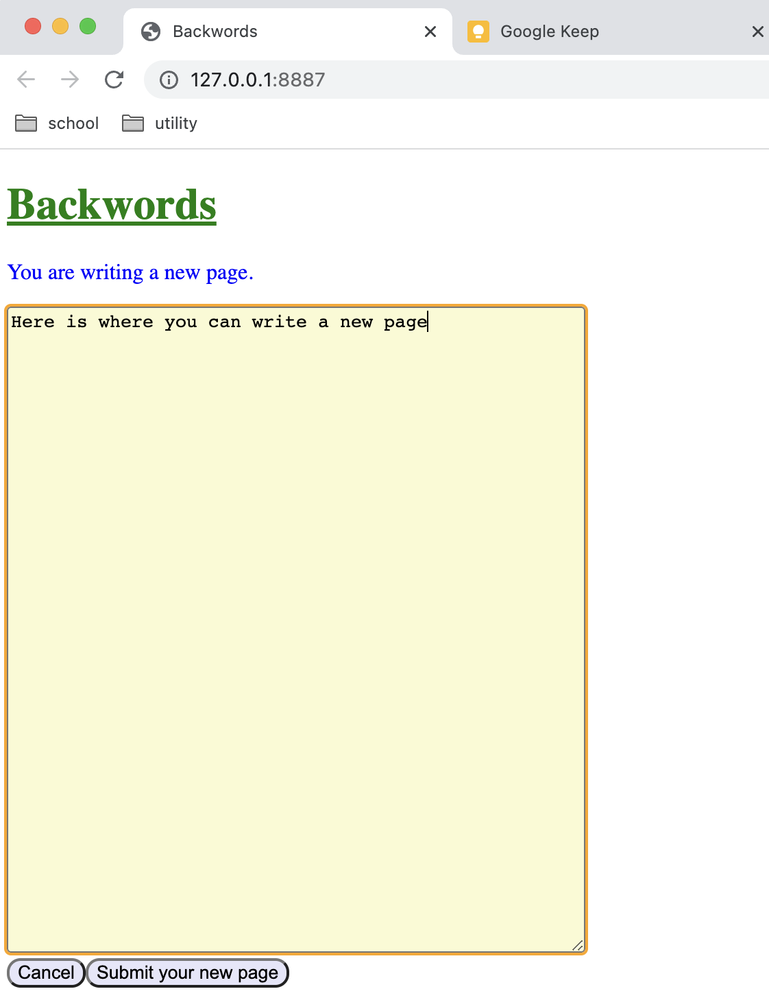
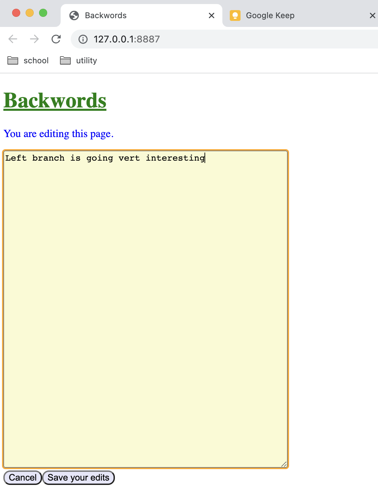
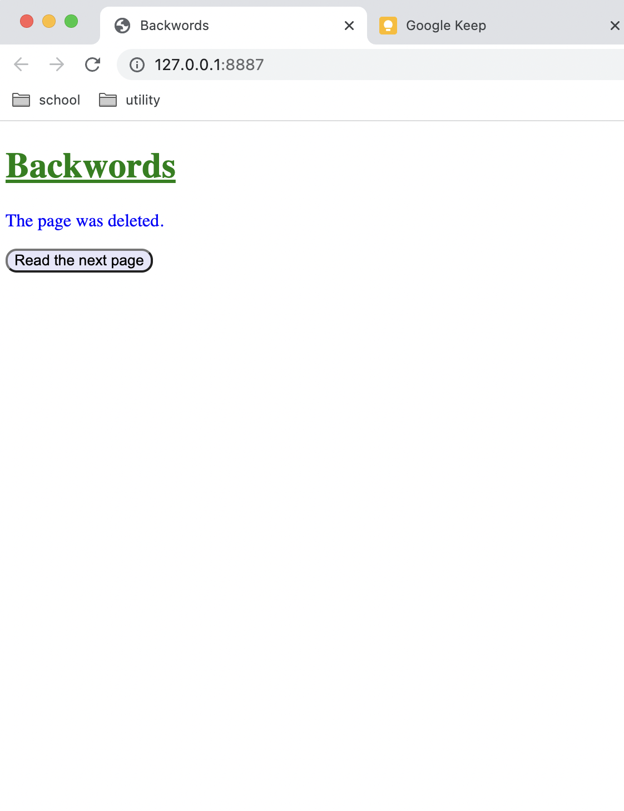

# Data Interactions

My idea has not changed at all since milestone #1, and I've implemented the user interface exactly as I listed in milestone #1. Here's the sections from my milestone #1 on data and iteractions copied over here:

### Application Idea

My application is called "Backwords", and is centered around the idea of writing a story or stories backwards collaboratively with other people. When the website starts, there is a single last page of the story that the server admin inserted in. Any person using the site can write a page that immediately precedes that page. Once there are multiple pages, users can choose any page to write a page before. This results in a story being written backwards with many branching paths as people make their own spins on it. Each page is stored as an entry in a database, and each entry will contain the following data:

- The page's unique id (pid)
- The body text of the page (body)
- A shortened preview of the page's body text (preview)
- The id of the next page after the current page (next_pid)
- A timestamp for when the page was created (timestamp)
- The number of pages that are immediately prior to the current page (num_prior)
- The number of pages until the end of the story (num_left)

In my code and on the website, I will use the concept of a "leaf". In short, a leaf is a page that has no pages immediately prior, meaning that no one has written a page before it. If you visualize all of the pages in a tree relationship, where the last page is the root of the tree, then these pages would indeed be called leaves in graph theory. I also like it because I want to use the idiom "Turn a new leaf" on the main page of the website. The main page will display all of the leaves, and starting reading from one is literally turning a new leaf, since it is the beginning of some story.

This website was inspired by fanfiction sites (ie. Archive of Our Own, FanFiction.Net, Wattpad, etc)

### Functionality

The application will be a single page application, however there will be multiple views in the single page to simulate going between different pages on the website. The current view and any associated data will be stored inside the browser's local storage in case the user leaves the page and comes back later. For example, if the user is writing a new page, and accidentally closes the browser, they can simply come back to the site and continue where they left off since the draft was saved in local storage.

Here is a list of views I have planned for my application:

- **Main page (Turn a new leaf):** This view will display all of the leaves in order of the latest creation date. Users can click on a leaf to read it.
- **View page:** This is the view where users can actually read the pages. There will be a button to go to the next page, and another button to create a new page before the current page. If the page is a leaf and not the last page, there will be a button to delete the page. I don't want users deleting non-leaf pages since at least one story relies on such pages.
- **Create page:** This is the view where the user can write a page. There will be a "cancel" button to cancel out of it and go back to the page, as well as a "submit" button to submit the page once they're done writing it.
- **Update page:** This is the view where a user can edit a page. Like the create page, there will be similar "cancel" and "create" buttons
- **Leaf deleted page:** This is the view that appears after a user deletes a leaf. It will have a button to go to the next page after the deleted leaf.

# HTML and CSS

Here are some screenshots of the user interface I made:

- **Main page (Turn a new leaf):** This is the main page that lists the recently created leaves that users can read

- **View page:** Here users can read a single page. There is some metadata shown above the page, along with buttons for interactions below the page

- **Create page:** Here is where users write a new page

- **Update page:** Here is where users can edit an already existing page

- **Leaf deleted page:** This is the page that users are directed to after deleting a page

# JavaScript

I have multiple event listeners added to DOM elements in my Javascript code. All of the buttons you can click have event listeners to make them functional. Also, in the create and update pages, there is a "keyup" event listener on the textarea, which makes it so that whenever an edit is made, it is saved in the browser's local storage. This way, if a user accidentally closes the website, they can come back to it later and their changes will still be saved locally.

# Video

[Here is the link to the video recording of the interface](https://drive.google.com/file/d/1v4_kZo5JEawZc-J6m6jeVwmW2NEiag4p/view?usp=sharing)